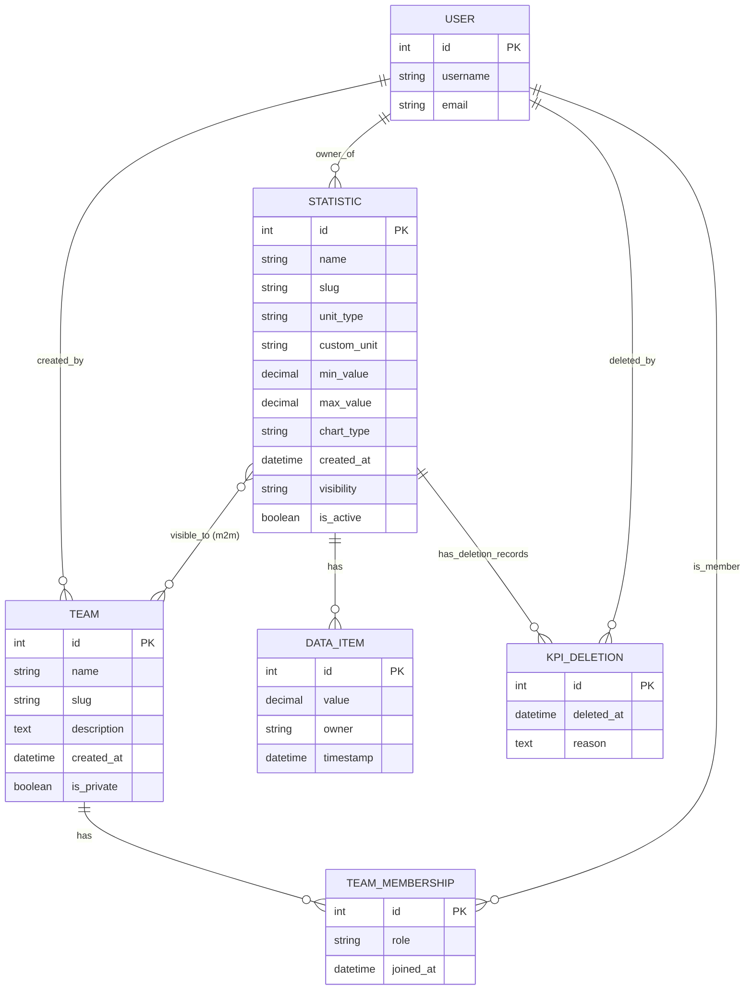

## Dashtia - ERD (generated from `stats/models.py`)

This file contains a Mermaid ER diagram representing the Django models found in `stats/models.py`.

Notes
- Diagram generated from `stats/models.py` (Team, TeamMembership, Statistic, DataItem, KpiDeletion).
- The `User` entity represents `django.contrib.auth.models.User` referenced by multiple FKs.
- Field types are mapped to generic types for readability (e.g. DecimalField -> decimal).

If you'd like the ERD to include additional apps/models (or want attribute-level cardinalities changed), tell me what to add and I'll update the diagram.
