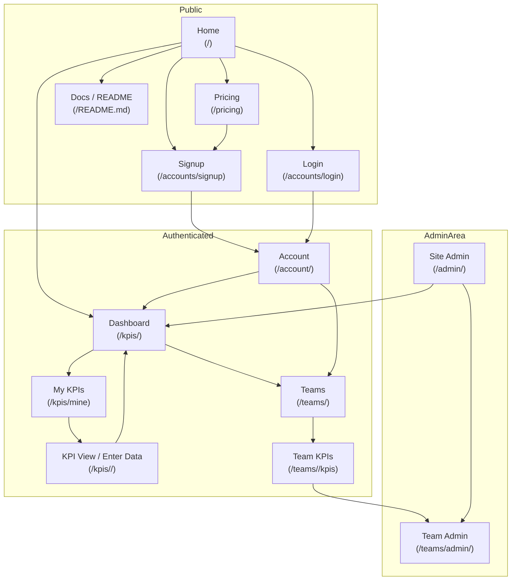

# Site Map

Below is a sitemap for the Dashtia project showing main pages and relationships.

```mermaid
flowchart TD
  %% Pages
  Home["Home\n(/)"]
  Pricing["Pricing\n(/pricing)"]
  Signup["Signup\n(/accounts/signup)"]
  Login["Login\n(/accounts/login)"]
  Dashboard["Dashboard\n(/kpis/)"]
  KPIList["My KPIs\n(/kpis/mine)"]
  KPIView["KPI View / Enter Data\n(/kpis/<slug>/)"]
  TeamList["Teams\n(/teams/)"]
  TeamAdmin["Team Admin\n(/teams/admin/)"]
  TeamKPIs["Team KPIs\n(/teams/<slug>/kpis)"]
  Account["Account\n(/account/)"]
  Admin["Site Admin\n(/admin/)"]
  Docs["Docs / README\n(/README.md)"]

  %% Navigation
  Home --> Pricing
  Home --> Signup
  Home --> Login
  Home --> Dashboard
  Home --> Docs

  Pricing --> Signup

  Signup --> Account
  Login --> Account

  Dashboard --> KPIList
  KPIList --> KPIView
  KPIView --> Dashboard

  Dashboard --> TeamList
  TeamList --> TeamKPIs
  TeamKPIs --> TeamAdmin

  Account --> Dashboard
  Account --> TeamList

  Admin --> Dashboard
  Admin --> TeamAdmin

  %% notes
  subgraph Public
    Home
    Pricing
    Signup
    Login
    Docs
  end

  subgraph Authenticated
    Dashboard
    KPIList
    KPIView
    TeamList
    TeamKPIs
    Account
  end

  subgraph AdminArea
    Admin
    TeamAdmin
  end
```
